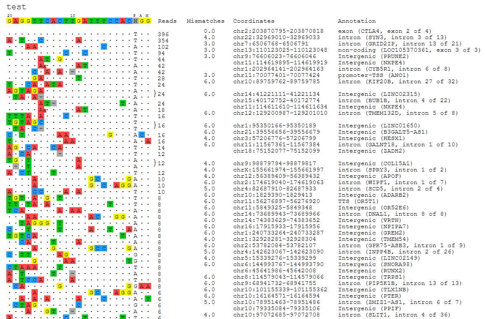

====================================================================
CHANGE-seq: *The CHANGE-Seq Analysis Package*
====================================================================

Contents:
---------
.. toctree::
	:maxdepth: 2

	content/Toy_example
	content/FAQ

Summary
^^^^^^

This is a repository for CHANGE-seq analytical software, which takes sample-specific paired-end FASTQ files as input and produces a list of CHANGE-seq detected off-target cleavage sites as output.

Steps
--------
This package implements a pipeline that takes in reads from the CHANGE-seq assay and returns detected cleavage sites as output. The individual pipeline steps are:

1. **Merge**: Merge read1 an read2 for easier mapping to genome.
2. **Read Alignment**: Merged paired end reads from the assay are aligned to the reference genome using the BWA-MEM algorithm with default parameters (Li. H, 2009).
3. **Cleavage Site Identification**: Mapped sites are analyzed to determine which represent high-quality cleavage sites.
4. **Visualization of Results**: Identified on-target and off-target cleavage sites are rendered as a color-coded alignment map for easy analysis of results.

Installation
^^^^^^^^^^^^^^

The most easiest way to install guideseq pipeline is via conda.

::

	conda create -n changeseq -c conda-forge -c bioconda -c anaconda -c omnia -c tsailabSJ changeseq

	source activate changeseq

	changeseq.py -h

	## BWA 0.7.17 and samtools 1.9 are automatically installed

	## If Homer is available, the identified off-targets will be annotated using "annotatePeaks.pl", specify the genome version in the YAML file.

Alternatively, you can git clone this repository and install

::

	git clone https://github.com/tsailabSJ/changeseq

	cd changeseq

	pip install -r requirements.txt

	python setup.py install

	changeseq.py -h

	## Please install BWA and samtools if you choose this option

Download Reference Genome
----------------

The CHANGEseq package requires a reference genome for read mapping. You can use any genome of your choosing, but for all of our testing and original CHANGE-seq analyses we use hg19 ([download](http://www.broadinstitute.org/ftp/pub/seq/references/Homo_sapiens_assembly19.fasta)). Be sure to (g)unzip the FASTA file before use if it is compressed.

Input
^^^^^^^

Writing A Manifest File
--------------
When running the end-to-end analysis functionality of the CHANGEseq package a number of inputs are required. To simplify the formatting of these inputs and to encourage reproducibility, these parameters are inputted into the pipeline via a manifest formatted as a YAML file. YAML files allow easy-to-read specification of key-value pairs. This allows us to easily specify our parameters. The following fields are required in the manifest:

- `reference_genome`: The absolute path to the reference genome FASTA file.
- `output_folder`: The absolute path to the folder in which all pipeline outputs will be saved.
- `bwa`: The absolute path to the `bwa` executable
- `samtools`: The absolute path to the `samtools` executable
- `read_threshold`: The minimum number of reads at a location for that location to be called as a site. We recommend leaving it to the default value of 4.
- `window_size`: Size of the sliding window, we recommend leaving it to the default value of 3.
- `mapq_threshold`: Minimum read mapping quality score. We recommend leaving it to the default value of 50.
- `start_threshold`: Tolerance for breakpoint location. We recommend leaving it to the default value of 1.
- `gap_threshold`: Distance between breakpoints. We recommend leaving it to the default value of 3 for Cas9.
- `mismatch_threshold`: Number of tolerated gaps in the fuzzy target search setp. We recommend leaving it to the default value of 6.
- `read_length`: Fastq file read length, default is 151.
- `PAM`: PAM sequence, default is NGG.
- `genome`: used for homer peak annotation, e.g., hg19, hg38, mm9, or mm10.
- `merged_analysis`: Whether or not the paired read merging step should takingTrue
- `samples`: Lists the samples you wish to analyze and the details for each. Each sample name should be nested under the top level samples key, and each sample detail should be nested under the sample name. See the sample manifest for an example.
    - For each sample, you must provide the following parameters:
        - `target`: Target sequence for that sample. Accepts degenerate bases.
        - `read1`: The absolute path to the .FASTQ(.gz) file containing the read1 reads.
        - `read2`: The absolute path to the .FASTQ(.gz) file containing the read2 reads.
        - `controlread1`: The absolute path to the .FASTQ(.gz) file containing the control read1 reads.
        - `controlread2`: The absolute path to the .FASTQ(.gz) file containing the control read2 reads.
        - `description`: A brief description of the sample

Output
^^^^^^^^

The outputted visualizations are in the `.svg` vector format, which is an open image standard that can be viewed in any modern web browser (e.g. Google Chrome, Apple Safari, Mozilla Firefox), and can be viewed and edited in any vector editing application (e.g. Adobe Illustrator). Because the output visualizations are vector images, they can be scaled up or down infinitely without a loss in quality, and can also be edited as shapes with ease. This makes the images produced by the guideseq package ideal for posters, presentations, and papers.

Usage
^^^^^^

The change-seq pipeline requires a manifest yaml file specifying input files, output directory, and pipeline parameters. Once the yaml file is created, users can simply run ``change_seq.py all --manifest /path/to/manifest.yaml``

Below is an example ``manifest.yaml`` file

::

    reference_genome: /data/joung/genomes/Homo_sapiens_assembly19.fasta
    analysis_folder: /data/joung/CHANGE-Seq/test2
    
    bwa: bwa
    samtools: samtools
    
    read_threshold: 4
    window_size: 3
    mapq_threshold: 50
    start_threshold: 1
    gap_threshold: 3
    mismatch_threshold: 6
    search_radius: 30
    merged_analysis: True
    
    samples:
        U2OS_exp1_VEGFA_site_1:
            target: GGGTGGGGGGAGTTTGCTCCNGG
            read1: /data/joung/sequencing_fastq/150902_M01326_0235_000000000-AHLT8/fastq/1_S1_L001_R1_001.fastq.gz
            read2: /data/joung/sequencing_fastq/150902_M01326_0235_000000000-AHLT8/fastq/1_S1_L001_R2_001.fastq.gz
            controlread1: /data/joung/sequencing_fastq/150902_M01326_0235_000000000-AHLT8/fastq/4_S4_L001_R1_001.fastq.gz
            controlread2: /data/joung/sequencing_fastq/150902_M01326_0235_000000000-AHLT8/fastq/4_S4_L001_R2_001.fastq.gz
            description: U2OS_exp1
        U2OS_exp1_EMX1:
            target: GAGTCCGAGCAGAAGAAGAANGG
            read1: /data/joung/sequencing_fastq/150902_M01326_0235_000000000-AHLT8/fastq/2_S2_L001_R1_001.fastq.gz
            read2: /data/joung/sequencing_fastq/150902_M01326_0235_000000000-AHLT8/fastq/2_S2_L001_R2_001.fastq.gz
            controlread1: /data/joung/sequencing_fastq/150902_M01326_0235_000000000-AHLT8/fastq/4_S4_L001_R1_001.fastq.gz
            controlread2: /data/joung/sequencing_fastq/150902_M01326_0235_000000000-AHLT8/fastq/4_S4_L001_R2_001.fastq.gz
            description: U2OS_exp1

